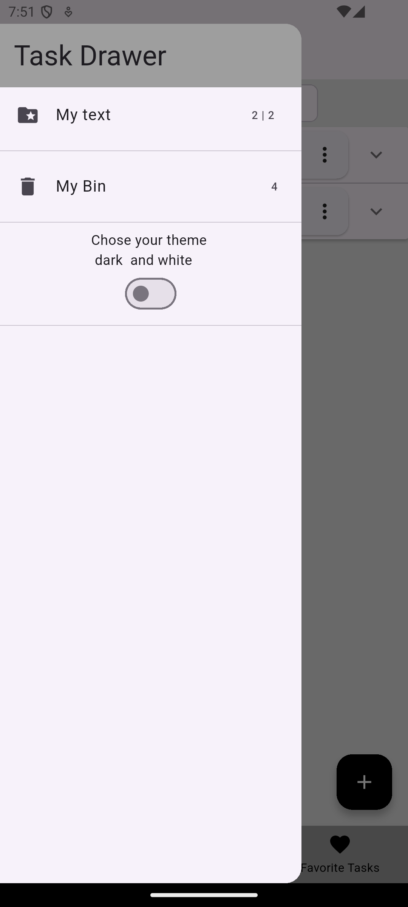
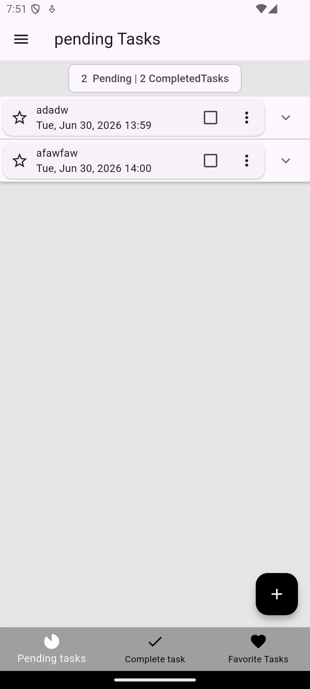
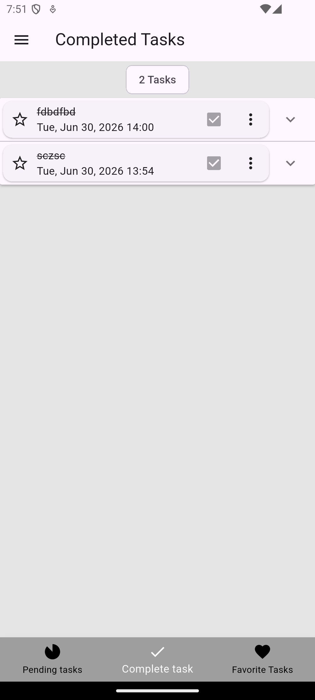
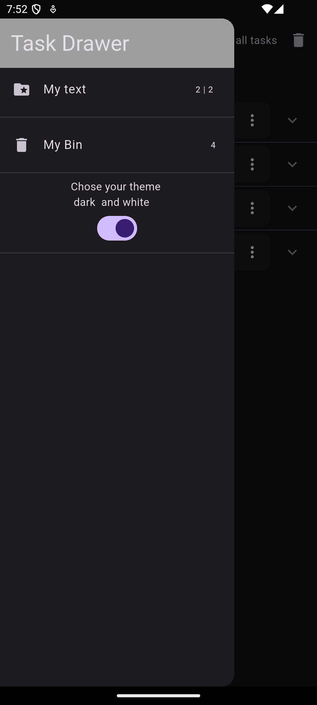
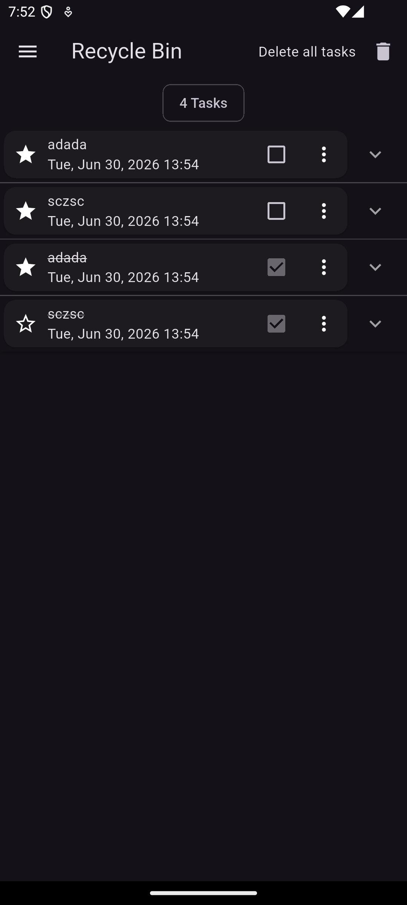
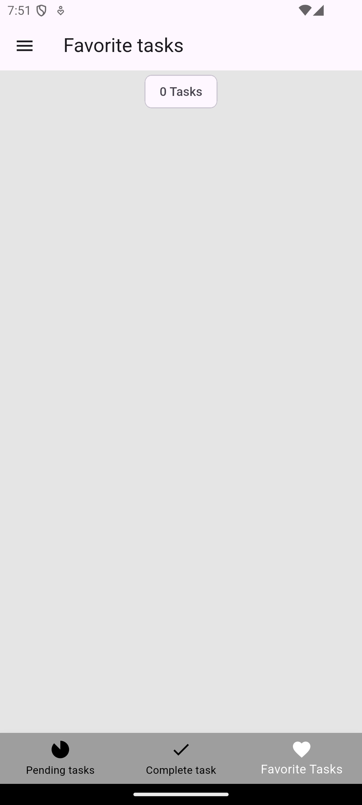

# bloc_apps

This app let's you to keep the tracks of your day to day task that are envolved in the activties. 

The ui/ux of the picture for following screen is indicated below 

<!-- 

 -->

<table>
  <tr>
    <td></td>
    <td></td>
    <td></td>
  </tr>
  <tr>
    <td></td>
    <td></td>
    <td></td>
    <td></td>
  </tr>
</table>

<h1> You can download the apk files below down there. it is fully developed apk just install in your mobile device  </h1>
<h3>
:smile: 
:grinning: 
:star: 
:star:
:download:
:arrow_down:
</h3>

